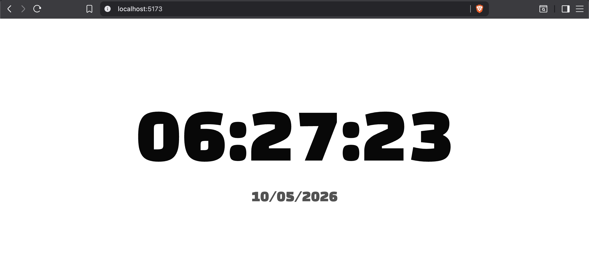

We use useEffect to render the callback function on loading the page, with empty dependency array, meaning it should run only once when the page reloads.

Inside the callback function, we have our asynchronus feature, setInterval that allows to run a certain code in certain interval of time. 

Here we set the current time to the time state. and try to display every updated time, in interval 1000ms i.e. 1s